# Flask Setup Tutorial (Windows)

This tutorial will help you install Python and Flask. Even though we are using a Django Stack installer, Flask installation will not be affected. The reason we are using a stack installer is to get you up and running in a breeze without the overhead of solving operating system compatibility issues.

[Bitnami](https://bitnami.com) as a company has been around for a while and they make our lives easier as you will see.

## 1. Setup Bitnami stack
### Step 1.1 [Click here](https://downloads.bitnami.com/files/stacks/djangostack/1.7.10-1/bitnami-djangostack-1.7.10-1-windows-installer.exe) to directly download the bitnami django stack
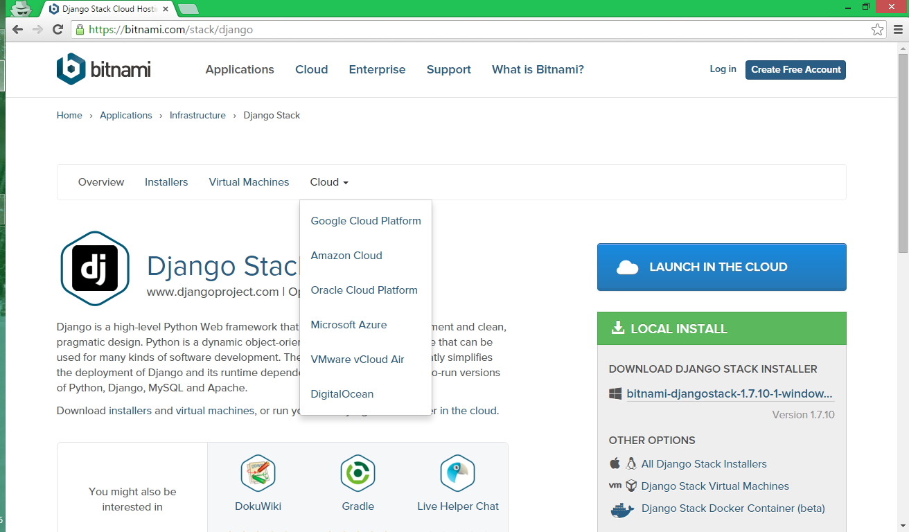

### Step 1.2 Run the installer
Once you download the installer, double click on the file and follow the instructions below. Some of the screenshots may not be identical to your machine.

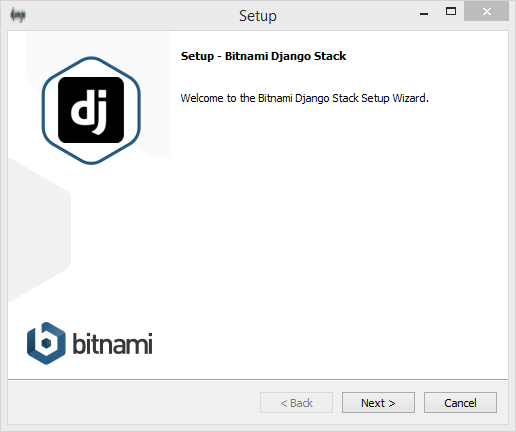

#### 1. Select Components
Django and (at least) one Database, preferably ```MySQL```, Click next
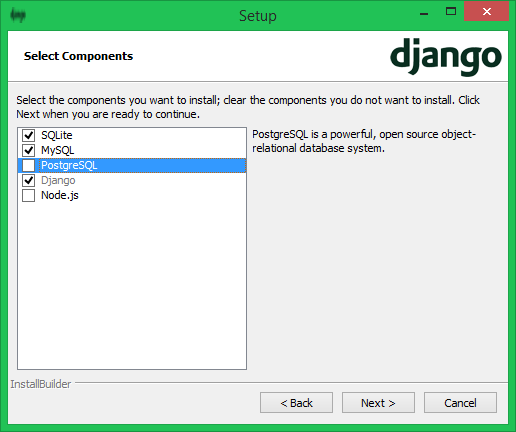

#### 2. Customize Installation Folder
You can select your own custom folder. We recommend ```C:\Bitnami\pythonstack``` for the folder path, Click next

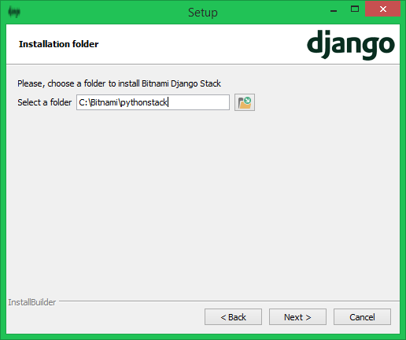

#### 3. Setup Password for your MySQL Server
You may choose to setup a password. But for now, leave it blank and Click next

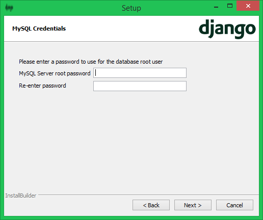

#### 4. Do not change association type
Select **NO** here, Click next

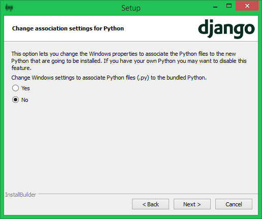

#### 5. Do not Create initial Project
Select **NO** here, Click next

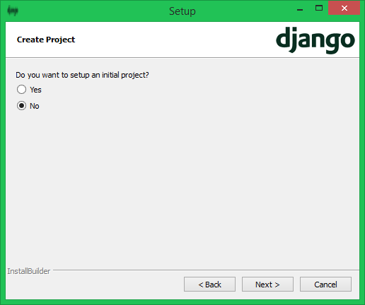

#### 6. Installation Process
Uncheck, Click next

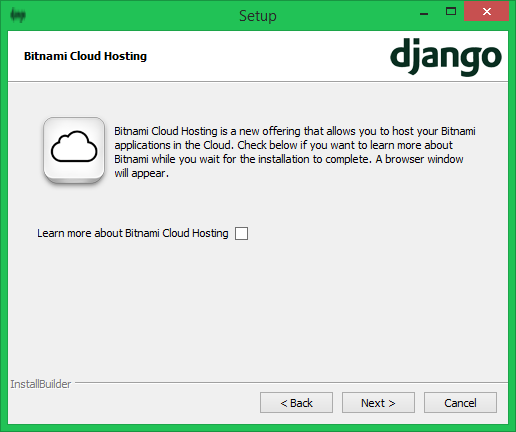

Click next

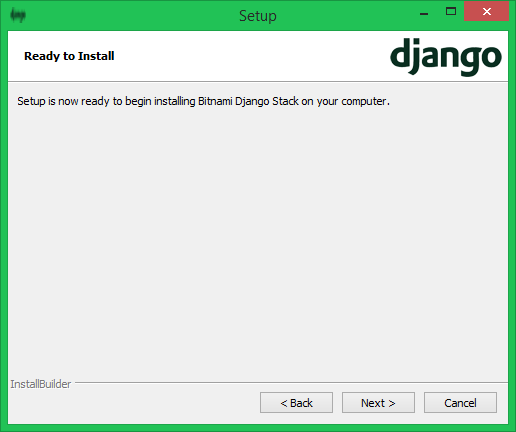

**[Caution]** The installation might take around 10 mins  


#### 7. Add firewall exception
This step may not be valid for all users, Click Allow access

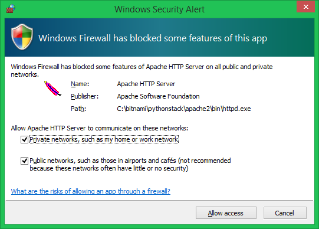

#### 8. Final Step - Uncheck and Click on Finish
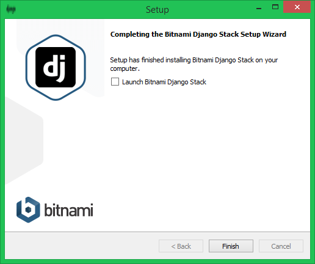

## 2. Start Bitnami and Install Flask
All the following steps should be repeated when creating a new directory or app.

#### Step 2.1.1 Open Command Prompt and run Bitnami

This is how the terminal (command prompt) may look like when you first open it

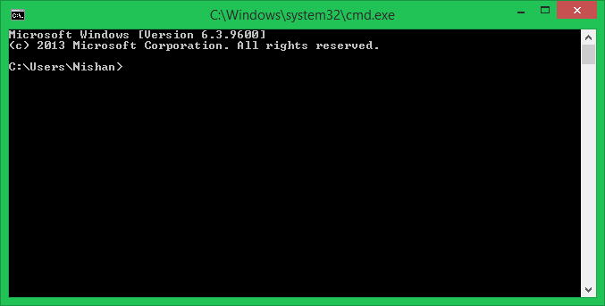

#### Step 2.1.2 Run Bitnami
Execute the following in the command prompt
```
cd C:\Bitnami\pythonstack\use_djangostack.bat
```


You should see the following window open after executing the above command

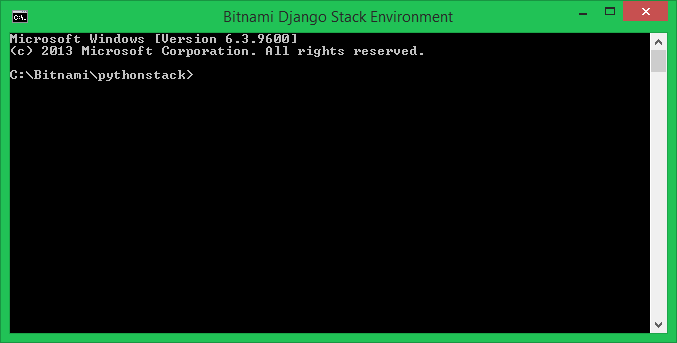

#### Step 2.2 Create a folder

In the new command prompt window which opens execute the following in sequence to create your first app folder

```
cd apps
mkdir test
cd test
```
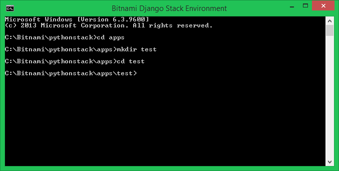

#### Step 2.3 Create Virtual Environment Wrapper
Execute the following command to install the virtu environment which creates a folder ```venv``` inside the ```test``` folder
```
virtualenv venv
```
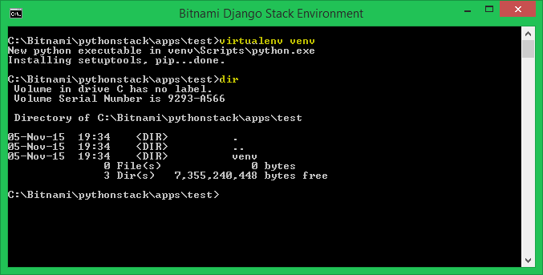

#### Step 2.4 Activate Virtual Environment Wrapper
This is required to isolate python libraries and create a safe container for your python apps/scripts. In the command prompt execute:
```
venv\Scripts\activate
```


#### Step 2.5 Install Flask
Execute the following command to install python Flask framework in the ```virtualenv```
```
pip install flask
```
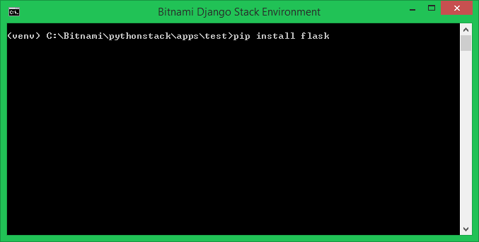

After successful installation of Flask you should see final success message

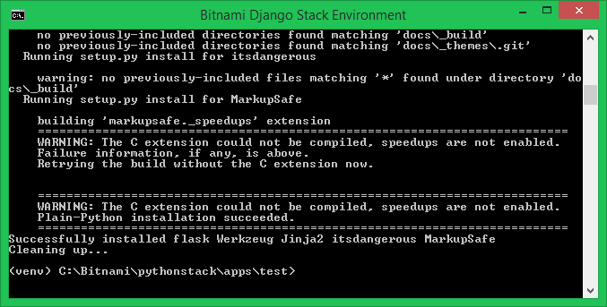

Flask is installed in ```venv``` folder to avoid any conflicts with other projects/apps.


## 3. Run the Hello World program
### Step 3.1 Create a python file in the current working directory

The current working directory is ```test```

Use a text editor (ex. Atom, Sublime, Vim ...) to create a file and save it as ```app.py```

### Step 3.2 Add the following python code to ```app.py```

**[Important]** Indentation is very important in Python. Code without correct indentation might not work.

```
from flask import Flask
app = Flask(__name__)

@app.route("/")
def hello():
    return "hello world"

if __name__ == "__main__":
    app.run()
```

### Step 3.3 Run the Server and Test it
#### 3.3.1 Run the Server
Save the file and make sure it is in the test folder we just created.
In the command prompt, execute:

```
python app.py
```

You will see something like the following to indicate your server is running correctly.

```
 * Running on http://127.0.0.1:5000/ (Press CTRL+C to quit)
```

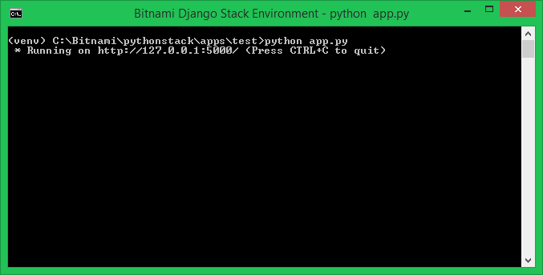


#### 3.3.2 Open it in the browser
In your browser's address box, type ```127.0.0.1:5000``` or ```localhost:5000```, and you should be able to see the following

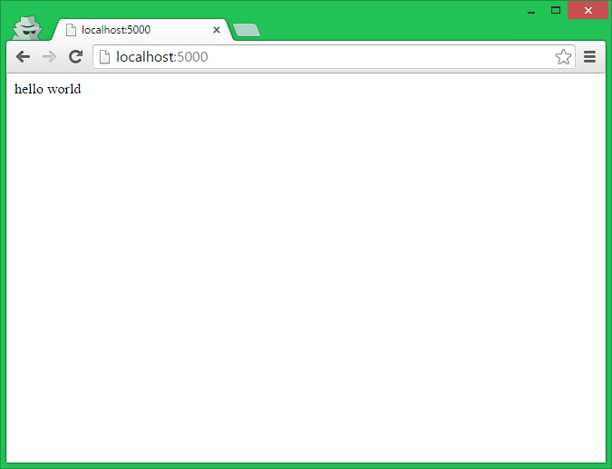

Phew. You have reached the end! Great job if you can see the ```hello world``` displayed in the browser window.
